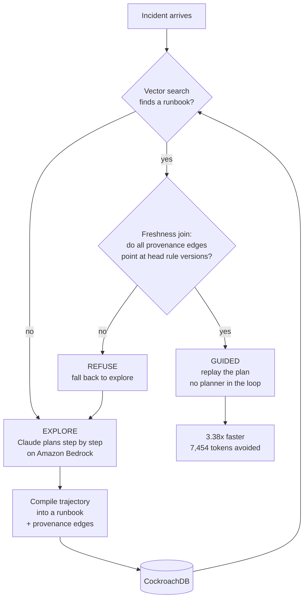
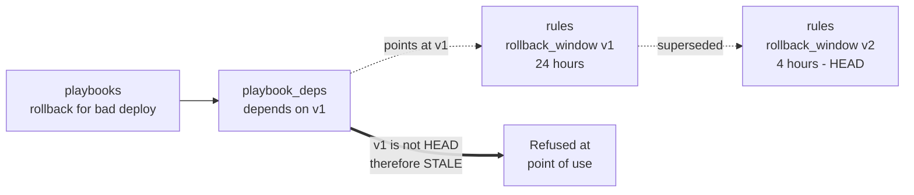

# Cascade

**An on-call agent that learns remediation runbooks from experience, and quarantines them the moment your policy changes.**

---

## Inspiration

It is 3:14 in the morning. The pager goes off. You are the on-call engineer.

You have seen this failure before. Someone on your team fixed it in April. There is a runbook in the wiki. You find it, you follow it, and you roll back the deploy.

What you did not know is that in June, your team shortened the automatic rollback window from 24 hours to 4, because a rollback of an old deploy took production down for nine minutes. Nobody updated the wiki. Nobody could have; the wiki does not know the policy changed.

The runbook was right when it was written. It was wrong when you ran it.

This is the failure we built Cascade to make impossible. Not "the agent did not know the answer" but something worse and quieter: **the agent knew an answer that had stopped being true.**

We kept coming back to one observation. Every agent-memory system we looked at was built to accumulate. None of them were built to forget. And in operations, an agent that cannot forget is not a helpful colleague. It is a liability that gets more dangerous the longer it runs, because it grows more confident about a world that has moved on.

So we asked a different question. Not "how does an agent remember?" but **"how does an agent know when to stop trusting what it remembers?"**

---

## What it does

Cascade is an incident-response agent with a procedural memory that has an expiry mechanism. It runs a three-phase loop.

- **Learn.** Faced with a novel incident, the agent explores step by step with Claude on Amazon Bedrock, calling tools against a mock production environment. When it succeeds, a compiler distills that trajectory into a reusable, parameterized runbook, together with explicit provenance edges recording every policy rule the procedure depended on.
- **Reuse.** On a similar incident, CockroachDB distributed vector search retrieves the runbook and the agent replays it with no planner in the loop. **Measured 3.38x faster, with 7,454 planning tokens avoided per reuse.**
- **Unlearn.** When an engineer changes a policy, one small transaction versions the rule. Every runbook derived from the old version is immediately unusable, refused at the point of use, and an asynchronous worker compiles a replacement.

The part we are proudest of is the third phase, and specifically one design decision inside it.

**Staleness is not a flag someone remembers to set. It is a join.**

A runbook is stale if and only if any provenance edge points at a rule version that is no longer the head version. Nothing writes "stale" to a runbook when a policy changes. The question is asked, and answered from data, every single time a runbook is about to execute.

This matters because the alternative fails in exactly the way the 3am story fails. If invalidation is a flag, then invalidation is a job that can be missed, delayed, or crash halfway through, and the window between "policy changed" and "flag written" is a window where a stale runbook executes against production. In Cascade that window does not exist, because there is no flag on the correctness path.

### Other capabilities

- **Autonomy gating.** A runbook that has not earned trust parks for human approval rather than acting. Resume is by replay, which is safe because every side-effecting tool is idempotent on a deterministic key.
- **Negative memory.** The agent records what did not work, so it stops re-deriving known dead ends.
- **Counterfactual replay.** Before committing a policy change, re-decide every historical incident under the proposed rule and see exactly what would break.
- **Insight engine.** Proposes the smallest policy change that recovers blocked work, and only when it blocks nothing new.
- **Ops Copilot.** Natural language over the memory layer, answering with the SQL it ran so you can check its work.

---

## How it works

The memory layer is four kinds of memory in one CockroachDB cluster, a split that follows the classical cognitive distinction between semantic and procedural knowledge.

| Memory | Table | Holds |
|---|---|---|
| Semantic | `rules` | Versioned policy. What the organization permits |
| Procedural | `playbooks` | Learned runbooks. How to act |
| Episodic | `episodes` | What actually happened, with outcomes |
| Working | `tasks` | In-flight state that survives a restart |

Provenance is the connective tissue between semantic and procedural memory.

### The transaction that makes it cheap

Changing a policy touches **four rows**, regardless of how many runbooks depend on it: close the old version, insert the new one, write one event, write one audit row. Measured at **16 to 26 milliseconds.**

We rejected the obvious design, which was one large transaction that versions the rule and mass-updates every dependent runbook. Under CockroachDB's serializable isolation that creates write contention against concurrent executors and produces retry storms. Deriving staleness instead of writing it is what makes the cascade O(1) in the size of the blast radius.

---

## How we built it

**Stack.** Python 3.12 and FastAPI on ECS Fargate behind an ALB and CloudFront. Next.js on Amplify. Claude Sonnet and Haiku on Amazon Bedrock for planning and compilation, Amazon Titan V2 for embeddings. A Lambda worker driven by SQS with a 60 second EventBridge sweeper. CockroachDB Cloud for all four memory types.

**CockroachDB tools used.** Distributed Vector Indexing is the core retrieval path. The Managed MCP Server was how we explored the schema and verified query plans during development. The ccloud CLI provisions the cluster. The Agent Skills repo produced schema findings we acted on.

**Retrieval is two statements, deliberately.** Combining a vector `ORDER BY` with scalar filters makes the planner abandon the index. So phase one is a pure ANN query carrying **no predicate at all**, and phase two re-reads the winners by primary key. We learned how strict this is the hard way: a single `WHERE embedding IS NOT NULL` was enough to drop the index and full-scan. The `EXPLAIN` proof is committed in the repo, on the production Cloud cluster.

**Every side effect is idempotent** on `{task_id}:{step_index}`, which is what makes resume-by-replay safe after an interrupt or approval.

**Policy is enforced by the tools, not by the model.** `apply_remediation` re-checks the head rules itself and refuses. The agent cannot talk its way past a policy, because the policy check is not in the conversation.

---

## Research foundations

Cascade's core mechanism is not a new idea. It is a very old one, applied where it had not been applied before.

- **Doyle (1979), "A Truth Maintenance System."** Dependency-directed backtracking: record *why* you believe something, and when a justification is retracted, everything resting on it loses support automatically. Our `playbook_deps` table is a justification network, and the freshness join is dependency-directed backtracking evaluated lazily at point of use.
- **Alchourrón, Gärdenfors and Makinson (1985), "On the Logic of Theory Change."** The AGM theory of belief revision formalizes contraction: retracting a belief and everything that depends on it while disturbing the rest as little as possible. Our O(1) cascade is a minimal-change contraction over a procedural knowledge base.
- **Tulving (1972), "Episodic and Semantic Memory."** The distinction our schema is built on, extended with the procedural and working memory of ACT-R style cognitive architectures (Anderson).
- **Wang et al. (2023), "Voyager."** Demonstrated that an LLM agent can build a reusable skill library from experience. Voyager's library grows monotonically. Cascade adds the missing operation: principled removal when the world invalidates a skill.
- **Shinn et al. (2023), "Reflexion"** and **Park et al. (2023), "Generative Agents."** Verbal reinforcement and memory-stream retrieval. Both accumulate; neither has a mechanism for a memory becoming *wrong* due to external change.
- **Packer et al. (2023), "MemGPT."** Memory hierarchy and paging. Manages memory *capacity*; Cascade manages memory *validity*.
- **Yao et al. (2022), "ReAct."** The interleaved reasoning and acting loop our explore mode follows.
- **Chen et al. (2021), "SPANN"** (NeurIPS). The memory-disk hybrid ANN design behind CockroachDB's C-SPANN vector index, which is what makes our phase one retrieval fast enough to sit on the hot path.
- **Taft et al. (2020), "CockroachDB: The Resilient Geo-Distributed SQL Database"** (SIGMOD). Serializable isolation across a distributed cluster is precisely what lets the cascade be four rows and still be correct under concurrency.

**The gap we fill, stated plainly:** the agent-memory literature is about acquisition and retrieval. The belief-revision literature is about retraction, and predates LLMs by decades. Cascade connects them, and puts the result on a production database where the retraction is a transaction rather than a theory.

---

## Challenges we ran into

- **A real model overfits preconditions; a deterministic stub does not.** Our first compile on a real LLM produced the precondition "the incident is of severity P1." The demo incident is P1 and the reuse incident is P2, so the runbook matched on retrieval and then refused itself. Reuse silently died. The model had described *the incident it saw* rather than *when the procedure applies*. We rewrote the compiler prompt to forbid encoding incidental properties and to steer toward what policy actually gates on. A local stub would never have surfaced this.
- **A precondition check that could not evaluate its own precondition.** The checker was asked to verify "deploy occurred within rollback window" while being handed only incident data. The window lives in the rules table. Unable to verify, it answered false, and every reuse fell back to explore. Speedup dropped to 0.94x. The fix was to pass the head rules into the check and to recognize that this check is a *routing* decision, not a safety gate; policy is enforced independently by the tools.
- **The admin token was being published in the page source.** `NEXT_PUBLIC_*` variables are inlined into the client bundle at build time, and our deploy script was reading the token out of Secrets Manager in order to put it there. It took a managed secret and made it public while looking secure. Fixed with a server-side proxy carrying an explicit allowlist.
- **Guided mode ignored its own eligibility check.** It called `check_remediation_eligibility`, recorded the answer, and then ran `apply_remediation` regardless. Explore mode was safe because the planner reads results; guided mode replayed steps mechanically. A tier-2 incident outside the rollback window would have been remediated in direct violation of policy. Found, fixed, and regression-tested.
- **Nine defects in deployment scripts that had never been executed**, including an S3 call that could not create a bucket in the project's own region, and IAM permissions granted to the ECS task role when secret injection runs under the execution role.

---

## Accomplishments that we are proud of

- **The unlearn guarantee is real and enforced, not asserted.** A stale runbook cannot execute, even in the seconds before any cache catches up, because correctness never depends on the cache.
- **3.38x measured, not estimated.** Cold 16,658ms to guided 4,922ms on Amazon Bedrock, with 7,454 planning tokens avoided per reuse.
- **81 automated assertions, zero failures**, run against real models rather than stubs. The suite refuses to run in stub mode, so a green result can never be a canned one.
- **A 16 to 26 millisecond policy cascade** that is independent of blast radius.
- **The vector index proof is committed**, including the full-scan plan that one stray predicate produced, because the failure is more instructive than the success.

---

## What we learned

- **Stubs hide the failures that matter.** Three of our most serious bugs were only reachable with a real model writing real output.
- **"Fail closed" is not automatically safe.** Our precondition checker failed closed and destroyed the entire value of the system while protecting nothing, because the actual safety gate was two layers below it. Knowing *which* layer is load-bearing matters more than defensive instinct.
- **Deriving beats writing.** Almost every hard problem got easier when we stopped storing a fact and started computing it. Staleness as a join instead of a column removed a write-contention bottleneck, an entire class of race condition, and the possibility of a missed update.
- **Provenance has to be grounded.** We verify every rule citation against the rules the agent actually read during the episode. A citation the model invented is rejected at compile time, because a provenance graph you cannot trust is worse than none.

---

## What is next

- **Real integrations,** behind the same policy gate. The mock world was a deliberate choice for demo determinism; the memory layer is domain-portable.
- **Authentication.** Cascade has authorization with three roles; it does not have authentication. Cognito or OIDC in front of CloudFront, with the principal resolved from a verified JWT. The `Principal` seam was designed for it.
- **Multi-tenancy**, which we deliberately did not half-build, because partial tenant isolation is a data-leak vector rather than a partial feature.
- **Cross-domain provenance.** Nothing about the mechanism is specific to incident response. Any agent whose procedures depend on versioned external facts (compliance, pricing, medical protocols, tax rules) has this problem.

---

## Why this should place first

**Most submissions will demonstrate an agent that remembers. Cascade demonstrates an agent that knows when its memory has expired, and refuses to act on it.**

Concretely, against the judging criteria:

- **Agentic Memory Design.** Four distinct memory types in one cluster, connected by a provenance graph, with a lifecycle that includes principled forgetting. CockroachDB is not a vector store bolted onto the side; the serializable transaction is what makes the invalidation correct, and the distributed vector index is what makes retrieval viable on the hot path.
- **Technical Implementation.** Two-phase retrieval with a committed query-plan proof. O(1) cascade. Transactional outbox with an idempotent claim. Exactly-once side effects. 81 assertions passing against live models.
- **Real-World Impact.** A stale runbook executing against production infrastructure is an outage multiplier, and every on-call engineer has met one. We reduce repeat-incident toil by 3.38x without trading away the safety that makes automation acceptable in the first place.
- **Production Readiness.** Scoped SQL roles with append-only audit enforced by grant. Circuit breakers, budget caps, idempotency, an audit trail that survives a demo reset, and a documented threat model that is honest about what we do not have.
- **Creativity and Originality.** Truth maintenance and belief revision are decades-old ideas from symbolic AI. Nobody had applied them to LLM procedural memory on a distributed database. That connection is the contribution.

We can also tell you exactly what Cascade does **not** do, which we think is part of the argument. It does not claim zero hallucination. It claims something narrower and testable: **a runbook whose provenance is stale cannot execute.** That is a guarantee you can check, and we wrote 81 assertions that check it.
